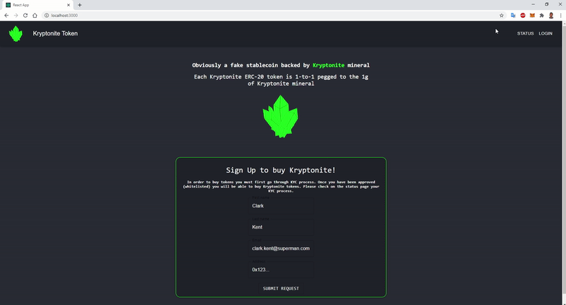
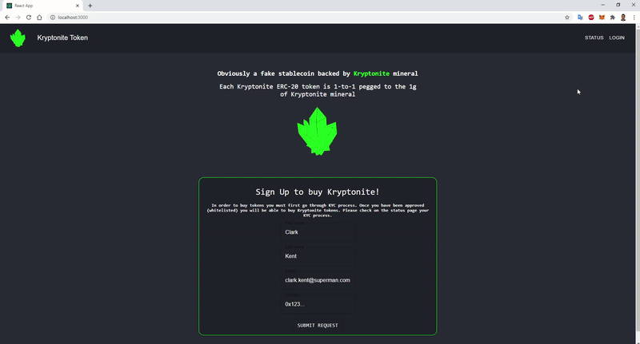
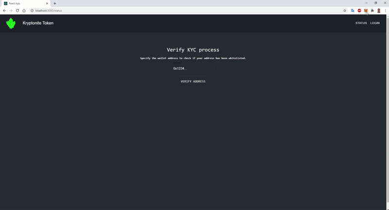

# Asset tokenization on Ethereum (ICO)

## ERC-20 Kryptonite token
This repository contains an `ERC-20 Kryptonite token` and crowdsale Dapp (`ICO`) for investing in tokens.

ERC-20 Kryptonite token is obviously a fake stablecoin backed by Kryptonite mineral ✳️💎. Each Kryptonite ERC-20 token is 1-to-1 pegged to the 1g of Kryptonite mineral.
For all Superman fans, the closest thing that we have in real life compared to Kryptonite is [Jadarite mineral discovered in Serbia](https://en.wikipedia.org/wiki/Jadarite).

## Introduction
In order to invest in ICO, investor must first register on the landing page, after which they will have to go through the KYC and AML process. Once KYC is completed and their address has been whitelisted, they can invest in the ICO by purchasing the tokens, either on the web app of by dirrecly sending the funds to the crowdsale smart contract address. In the meantime, they may check the KYC process on the status page, until admins whitelist them from the admin page.

Described Dapp is implemented with [ReactJS](https://reactjs.org/), with [Material-UI](https://material-ui.com/) on top. For working with ethereum blockchain, [Truffle](https://www.trufflesuite.com/truffle) was used with [React Truffle Box](https://www.trufflesuite.com/boxes/react) boilerplate and [MetaMask](https://metamask.io/) for interacting with Dapp. [OppenZeppelin](https://openzeppelin.com/contracts/) was used as a reference for smart conract implementation and [Firebase](https://firebase.google.com/) for hosting the database.

## Dapp demo

1. Investor registers for the ICO on the Landing Page by specifying necessary details, including his/her address which will be used to transfer the funds to invest in the tokens. 

   He/she is redirected on the Status page, where they can check the KYC process. Once the process is completed, they would be able to purchase the tokens.

   

2. After that the token issuance team will go through KYC/AML process for each investor request and and approve/disapprove investors to participate in crowdsale.

   From Admin Dashboard they will whitelist/revoke investor addresses on the KYC contract. Crowdsale contract communicates with KYC contract to know which addresses are approved to purchase the tokens.

   

3. One the KYC process is completed, and investor's address has been whitelisted, ivestor will able to purchase the Kryptonite tokens either by directly sendign funds to the crowdsale cotract or from the web app.

   

## Project structure
In this repository you may find:
- `truffle-config.js` file - contains solidity compiler version and different networks to migrate the contracts to.
- `contracts` directory - contains smart contracts for Dapp: 
  1. `Crowdsale.sol` - Crowdsale contract from the OpenZeppelin.
  2. `KryptoniteToken` - Contract extending ERC20 contract from the OpenZeppelin.
  3. `KryptoniteTokenSale.sol` - Contract extending the Crowdsale contract.
  4. `KYCContract.sol` - KCY contract to store approved addresses.
  5. `Migrations.sol` - Migrations contract.
- `test` directory - contains unit tests for the smart contracts.
- `migrations` directory - contains migration files for smart contracts.
- `client` directory - contains ReactJS app.
 
## How to run code?

NodeJS version: `v10.15.0`.  
Solidity compiler version: `v0.6.6`.  
Truffle: `v5.1.40`.

Setting up and running the application :
- Install truffle:  `npm install truffle -g`
- Install npm moduls: 
  1. `npm install` in the root directory (for truffle and unit tests)
  2. `cd client` & `npm install` (for ReactJS app)
- Start `Ganache` and update truffle-config file if necessary with the network parameters.
- Compile and migrate smart contracts to the local blockchain (from truffle console): `truffle migrate --network "development/ganache-local" --reset`.
- Start react app: `cd client` & `npm start`.

To test the smart contracts:
- In the root directory: `truffle test`.

